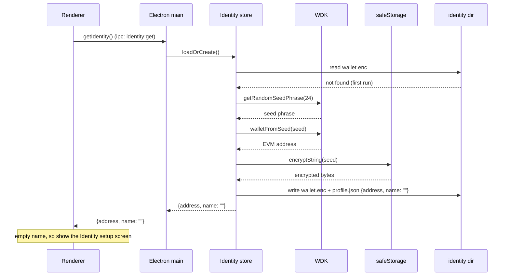
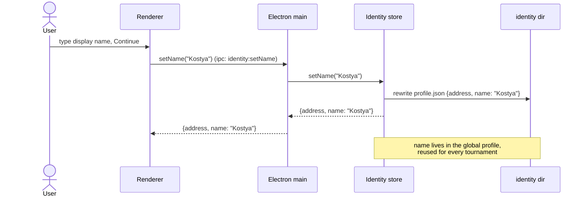

# ubet

Peer-to-peer prediction pool built on [Autobase](https://github.com/holepunchto/autobase) (multi-writer Hypercore) and [Hyperswarm](https://github.com/holepunchto/hyperswarm).

---

## Append-only log

Each tournament is backed by an Autobase log. Every participant appends signed JSON entries to their own Hypercore; Autobase linearises the writes into a deterministic order and materialises a [Hyperbee](https://github.com/holepunchto/hyperbee) key/value view.

### Entry types

All entries share a `type` discriminator field. Entries marked **host only** are ignored unless appended from the tournament's host key.

| `type`         | Appended by | When                                                                | Payload (besides `type`)                           |
| -------------- | ----------- | ------------------------------------------------------------------- | -------------------------------------------------- |
| `init`         | Host        | Once, at tournament creation                                        | `host`                                             |
| `add-writer`   | Host        | Admitting a participant into the multi-writer set                   | `key`, `name`                                      |
| `identity`     | Participant | Binding the appending writer key to a wallet address + display name | `writerKey`, `address`, `name`, `sig`, `createdAt` |
| `add-match`    | Host only   | Registering a new match                                             | `id`, `teamA`, `teamB`, `createdAt`                |
| `commit`       | Participant | Locking in a hidden prediction while the match is `open`            | `matchId`, `hash`, `name`, `createdAt`             |
| `lock`         | Host only   | Closing a match to new predictions                                  | `matchId`, `createdAt`                             |
| `update-score` | Host only   | Recording the current score of a `locked` match; repeatable         | `matchId`, `a`, `b`, `createdAt`                   |
| `finish-match` | Host only   | Ending a `locked` match; no further `update-score` accepted after   | `matchId`, `createdAt`                             |
| `reveal`       | Participant | Auto-appended once the match is `locked`, disclosing score + nonce  | `matchId`, `score`, `nonce`                        |
| `chat`         | Participant | Posting a message to a match's chat thread                          | `matchId`, `text`, `name`, `createdAt`             |

Notes:

- `id` is a 16-char hex string; `matchId` references it.
- `teamA` / `teamB` are ISO 3166-1 alpha-2 codes. Display names, alpha-3 codes, and flag emoji are backfilled from the countries catalog on the renderer side.
- `hash = BLAKE2b(score + '\n' + nonce)` where `score` is `"<a>-<b>"` (e.g. `"2-1"`) and `nonce` is 32 random bytes encoded as hex. `reveal` is verified against the earlier `commit` hash before the prediction is marked valid.
- `createdAt` is a wall-clock epoch-millis timestamp supplied by the writer; used to order the chat feed and its derived system events.
- `chat.text` is trimmed and capped at 2000 characters; empty or over-long messages are dropped, as are entries referencing an unknown `matchId`.
- Locking a match seeds its score at `0-0`; `update-score` can be called any number of times afterward while the match is `locked`. `finish-match` moves it to `final`, after which further `update-score` calls are rejected.
- Chat entries carry a `kind` of `message` (a real participant message) or `system` (an auto-generated announcement for `update-score`/`finish-match`), both delivered through the same ordered chat stream.

---

## Materialised view (Hyperbee)

The `apply` function reduces the linearised log into a Hyperbee key/value store:

| Key                           | Value                                                                                                                                       |
| ----------------------------- | ------------------------------------------------------------------------------------------------------------------------------------------- |
| `meta/host`                   | `"<writer-key-hex>"`                                                                                                                        |
| `meta/chatSeq`                | `<number>` — monotonic counter giving chat messages a total order                                                                           |
| `writer/<key>`                | `{ "name", "address"?, "sig"? }` — `address`/`sig` are set by an `identity` entry; `verified` is derived per-node at read time (not stored) |
| `match/<id>`                  | `{ "id", "teamA", "teamB", "status": "open"\|"locked"\|"final", "createdAt", "lockedAt"?, "result"?: { "a", "b" }, "finishedAt"? }`         |
| `pred/<matchId>/<author-key>` | `{ "matchId", "author", "authorName", "hash", "status": "committed"\|"revealed"\|"invalid", "score"?, "committedAt" }`                      |
| `chat/<matchId>/<padded-seq>` | `{ "matchId", "kind": "message"\|"system", "author", "authorName", "text", "createdAt", "seq" }`                                            |

---

## Local files

Two kinds of on-disk state live under the app-data root. The **global identity** is one wallet per user/device, shared across every tournament; each **tournament** has its own directory.

### Global identity — `<app-data>/identity/`

| File           | Contents                                                                                                  |
| -------------- | --------------------------------------------------------------------------------------------------------- |
| `wallet.enc`   | the BIP-39 seed, encrypted with the OS keychain (`safeStorage`); held only in Electron main, never shared |
| `profile.json` | `{ "address", "name", "badges": [] }` — the derived EVM address and the chosen display name               |

### Per tournament — `storeDir` = `<app-data>/tournaments/<id>/`

| File              | Contents                                                                             |
| ----------------- | ------------------------------------------------------------------------------------ |
| `tournament.json` | `{ "key", "name", "createdAt" }` — tournament manifest, written once                 |
| `secrets.json`    | `{ "<matchId>": { "a", "b", "nonce" } }` — plaintext scores and nonces, never shared |

---

## Wallet identity

Identity is a self-custodial [WDK](https://docs.wdk.tether.io/) wallet. Its derived EVM address is a **stable, cross-tournament** identifier; the human-readable display name is a label bound to that address by an EIP-712 signature. Because WDK cannot run under the Bare worker (its dependency tree fails Bare's bundled semver engine-range parser), the wallet, the encrypted seed, and `safeStorage` all live in **Electron main**. The worker holds no keys — it delegates signing and verification to main over its pipe, and the seed never enters any tournament log.

### 1. Identity is created on first run

The renderer asks main for the identity; if none exists yet, a wallet is generated, its seed encrypted with the OS keychain, and an empty profile written — all before the UI renders.



### 2. A display name is associated with the identity

The name is chosen once and stored in the **global profile**, so it travels with the wallet into every tournament. It can be edited later from the same screen.



### 3. The identity is bound into a tournament store

The tournament store is the per-tournament Autobase log (§ Append-only log). On create/join, the worker fetches the identity from main, has main sign an `identity` binding, and appends it to the log. The reducer accepts it only if the binding's `writerKey` equals the entry's actual Autobase author (a replay guard — no crypto in the reducer). Signature verification is a per-node concern: the session asks main to verify each peer's signature and caches the result, surfacing `verified` in `participants`.

```mermaid
sequenceDiagram
    actor U as User
    participant R as Renderer
    participant Wk as Worker
    participant M as Electron main
    participant L as Tournament log
    participant P as Peers

    U->>R: Create / Join tournament
    R->>Wk: create-tournament / join-tournament
    Wk->>M: wallet-identity  (over pipe)
    M-->>Wk: {address, name}
    Wk->>L: open session (tournaments/{id}/)
    Wk->>M: wallet-sign {writerKey, name}
    Note over M: signs Identity{writerKey, address, name}<br/>with the wallet — seed never leaves main
    M-->>Wk: signature
    Wk->>L: append identity {writerKey, address, name, sig}
    Note over L: reducer: writerKey must equal the entry's<br/>author (replay guard); then store writer/{key}
    L-->>P: replicate entry
    Note over Wk: per participant, once, then cached
    Wk->>M: wallet-verify {writerKey, address, name}, sig
    M-->>Wk: true / false
    Wk-->>R: log-state {participants: {key: {address, name, verified}}}
```

**Two stores, one identity.** The global identity store (`identity/`) is a single wallet per device; each tournament store (`tournaments/<id>/`) is an independent P2P log. The wallet is layered _onto_ each tournament by publishing a signed `identity` entry — so the same address (and its display name and, later, achievement badges) is recognizable across every tournament, while the seed stays confined to Electron main.
